# CleanShot — Production-Quality Lossless Photo Metadata Stripper & EXIF Inspector

<div align="center">

**Remove EXIF, GPS coordinates, device serial numbers, timestamps, and camera fingerprints from photos in bulk losslessly with zero quality loss directly in your browser.**

[](#testing)
[](https://www.typescriptlang.org/)
[](https://nextjs.org/)
[](https://tailwindcss.com/)
[](LICENSE)

</div>

---

## 📸 Overview

CleanShot is a privacy-first web application engineered to strip sensitive metadata from photos in bulk without decoding and re-compressing pixel data. 

Unlike conventional image tools that run files through lossy image re-encoders (introducing compression artifacts, color shifts, and blurring), CleanShot operates directly on the binary container stream. It surgically removes `APPn`, `COM`, `tEXt`, `EXIF`, and `XMP` metadata blocks while keeping raw DCT and raster data 100% byte-exact and untouched.

---

## 🏛 Architecture Diagram

```mermaid
flowchart TD
    subgraph Client ["Client Browser (100% In-Memory / Web Worker Pool)"]
        A[User Drops 100+ Photos / Folders / Clipboard] --> B[Magic Byte Format Detector]
        B --> C[Web Worker Concurrency Pool]
        C --> D[EXIF Inspector & GPS Risk Scanner]
        C --> E[Lossless Byte-Stream Stripper Engine]
        E -->|JPEG APPn/COM Filter| F[Cleaned Binary Stream]
        E -->|PNG Ancillary Chunk Filter| F
        E -->|WebP RIFF/VP8X Filter| F
        E -->|GIF/TIFF/HEIC/AVIF/SVG Sanitizer| F
        F --> G[Pixel-Identical Verification Badge]
        F --> H[Streaming ZIP Generator - fflate STORE]
        H --> I[Instant Single/Bulk ZIP Download]
    end

    subgraph Server ["Optional Server-Side Fallback Mode (Fastify / Next API)"]
        J[POST /api/jobs Multipart Upload] --> K[Magic Byte Validation Sandbox]
        K --> L[In-Memory Byte-Stream Stripper]
        L --> M[GET /api/jobs/:id/zip Streamed Archive]
        L --> N[15-Min Ephemeral Auto-Purge TTL]
    end
```



---

## ✨ Core Features

- ⚡ **Bulk Upload**: Drag-and-drop, click to browse, clipboard paste (`Ctrl+V`), and whole-folder uploads. Supports 100+ files per batch and up to 100 MB per file.
- 🛡️ **Zero Quality Loss**: Direct binary segment stripping without recompression.
  - **JPEG**: Surgically drops `0xFFE1` (EXIF/XMP), `0xFFED` (8BIM), `0xFFFE` (COM) and copies `0xFFDA` (SOS) DCT stream directly.
  - **PNG**: Drops `tEXt`, `zTXt`, `iTXt`, `eXIf`, `tIME`, `dSIG` (C2PA) while preserving `IHDR`, `PLTE`, `IDAT`, `IEND`.
  - **WebP**: Drops `EXIF` and `XMP ` FourCC chunks and updates `VP8X` bitmask flags.
  - **GIF**: Drops Comment Extensions (`0x21 0xFE`) and non-animation application metadata.
  - **HEIC / AVIF / TIFF / RAW / SVG**: Formatted container sanitization.
- 🔍 **Metadata Inspector**: Full breakdown of EXIF, IPTC, XMP, MakerNotes, and camera parameters with sensitive GPS leak alerts and interactive map coordinates.
- 🎨 **Color & Orientation Fidelity**: "Keep ICC Color Profile" (default ON) prevents color shifts on wide-gamut displays (Display P3, Adobe RGB).
- 📦 **Instant Streamed ZIP**: Uncompressed `STORE` (0-overhead) ZIP generation in the browser using `fflate`.
- 🔒 **Zero Server Uploads**: 100% of processing happens client-side in Web Workers. Files never leave the device unless server fallback mode is selected.
- 🌙 **Dark & Light Mode**: Fluid responsive design with Tailwind CSS and Framer Motion micro-interactions.

---

## 📁 Folder Structure

```
CleanShot/
├── sample-images/                # Sample test fixture photos with embedded EXIF & GPS
│   ├── sample_camera_gps.jpg
│   ├── sample_extended_header.webp
│   ├── sample_graphic_author.png
│   └── sample_vector_generator.svg
├── src/
│   ├── app/                      # Next.js App Router
│   │   ├── api/                  # Server REST API endpoints
│   │   │   ├── inspect/route.ts  # POST /api/inspect
│   │   │   └── jobs/             # POST /api/jobs, GET /api/jobs/[id], ZIP stream
│   │   ├── faq/page.tsx          # FAQ page
│   │   ├── formats/page.tsx      # Supported formats matrix
│   │   ├── how-it-works/page.tsx # Architecture & lossless guide
│   │   ├── inspector/page.tsx    # Standalone EXIF inspector tool
│   │   ├── privacy/page.tsx      # Privacy statement
│   │   ├── globals.css           # Tailwind base styles
│   │   ├── layout.tsx            # Root layout & SEO metadata
│   │   └── page.tsx              # Main batch processing app
│   ├── components/               # UI components
│   │   ├── ActionBar.tsx         # Sticky batch action bar & ZIP downloader
│   │   ├── DropZone.tsx          # Animated drag-and-drop & clipboard uploader
│   │   ├── FileList.tsx          # Batch file queue & status cards
│   │   ├── Header.tsx            # Navigation header & theme switcher
│   │   ├── InspectorModal.tsx    # EXIF before/after inspection modal
│   │   ├── SettingsModal.tsx     # Stripping & export settings drawer
│   │   ├── SummaryCard.tsx       # Post-cleaning metrics summary
│   │   └── ThemeProvider.tsx     # Dark/Light mode context
│   └── lib/
│       ├── engine/               # Pure lossless byte-stream strippers
│       │   ├── __tests__/        # Vitest unit test suite & fixtures
│       │   ├── bmff.ts           # ISOBMFF (HEIC/AVIF) box parser
│       │   ├── gif.ts            # GIF block stream parser
│       │   ├── inspector.ts      # EXIF & GPS risk analyzer
│       │   ├── jpeg.ts           # JPEG APPn/COM segment stripper
│       │   ├── magic.ts          # Magic byte format detection
│       │   ├── png.ts            # PNG chunk filter
│       │   ├── stripper.ts       # Unified engine orchestrator
│       │   ├── svg.ts            # SVG metadata cleaner
│       │   ├── tiff.ts           # TIFF IFD tag sanitizer
│       │   ├── types.ts          # TypeScript types & interfaces
│       │   └── webp.ts           # WebP RIFF chunk filter
│       ├── server/               # In-memory ephemeral job cache (15-min TTL)
│       ├── worker/               # Web Worker concurrent runner
│       └── zip/                  # Client-side streaming ZIP generator
├── Dockerfile                    # Production multi-stage Alpine Docker build
├── docker-compose.yml            # Docker Compose orchestration
├── LOSSLESS_GUARANTEE.md         # In-depth lossless technical specification
├── package.json
├── tailwind.config.ts
├── tsconfig.json
└── vitest.config.ts
```

---

## 🚀 Getting Started

### Prerequisites
- Node.js 18.x or 20.x+
- npm or pnpm / yarn

### Installation

```bash
# Clone the repository
git clone https://github.com/your-username/cleanshot.git
cd cleanshot

# Install dependencies
npm install

# Start development server
npm run dev
```

Visit `http://localhost:3000` in your browser.

---

## 🧪 Testing

CleanShot includes an automated test suite verifying magic byte detection, filename sanitization, and lossless segment stripping for JPEG, PNG, WebP, SVG, and TIFF.

```bash
# Run unit tests
npm test

# Run tests in watch mode
npm run test:watch
```

---

## 🐳 Docker Deployment

You can build and deploy CleanShot instantly with Docker:

```bash
# Build and start container
docker-compose up -d --build

# View container logs
docker-compose logs -f
```

The application will be accessible at `http://localhost:3000`.

---

## 🔌 Backend REST API Specification

For environments requiring server-side fallback, CleanShot exposes REST endpoints:

| Method | Endpoint | Description |
|---|---|---|
| `POST` | `/api/jobs` | Multipart batch upload with options. Returns `jobId` and processed file list. |
| `GET` | `/api/jobs/:id` | Status, file list, and progress of a batch job. |
| `GET` | `/api/jobs/:id/files/:fileId` | Download a single cleaned image file. |
| `GET` | `/api/jobs/:id/zip` | Download all cleaned photos in an uncompressed streamed ZIP. |
| `DELETE` | `/api/jobs/:id` | Immediately purge job and all image buffers from memory. |
| `POST` | `/api/inspect` | Inspect file metadata without modifying the image. |

---

## 📄 License

This project is licensed under the MIT License.
